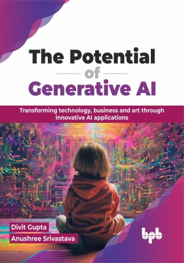

# The Potential of Generative AI

Unveiling the power and potential of Generative AI for a limitless future

This is the repository for [The Potential of Generative AI
](https://bpbonline.com/products/the-potential-of-generative-ai?variant=43110400983240),published by BPB Publications.

## About the Book
The Potential of Generative AI invites you for a captivating journey into the revolutionary technology, where machines become co-creators and the line between imagination and reality blurs. You will learn how AI helps doctors, engineers, and scientists solve real-world problems.

Next, you will explore use cases where ChatGPT can boost productivity and enhance creativity. The book explores the journey from the origins of this revolutionary technology to its cutting-edge applications. Discover how generative models like GANs and VAEs work, and familiarize yourself with the impact they are making in fields like healthcare, finance, and art. Through real-world case studies and engaging examples, you will witness AI generating life-saving drugs, composing music, and even designing innovative products.

This book explores the cutting-edge capabilities and potential of generative AI in the tech landscape. It will help you discover how generative AI can unlock new opportunities and enhance business operations.

## What You Will Learn
• Learn about the different types of generative models, how they work, and their impact across various industries including healthcare, finance, and entertainment. 

• Explore the creative potential of generative AI in art, music, and design.

• Develop Generative Adversarial Networks (GANs), with a focus on their architecture, training process, and real-world applications. 

• Build and deploy generative models, ensuring readers to leverage this powerful technology.

• Perfect the art of generating text, images, music, and even code with AI, utilize your creative potential.
